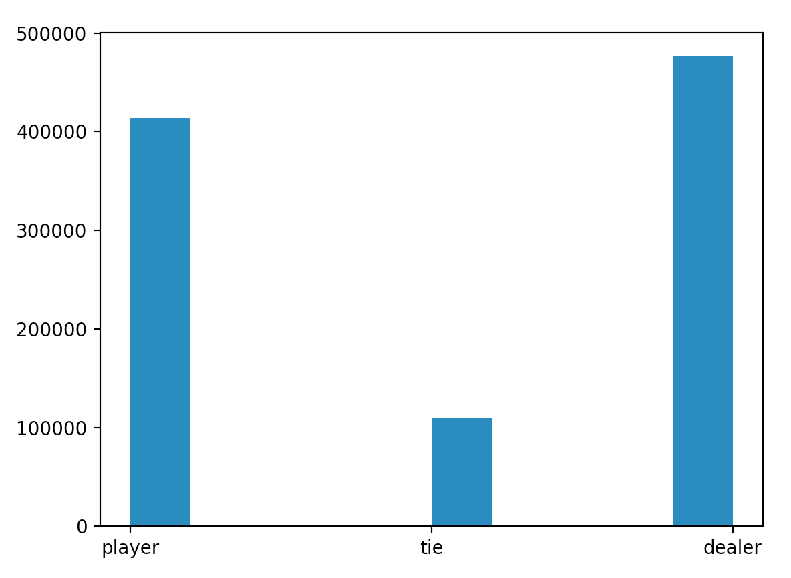
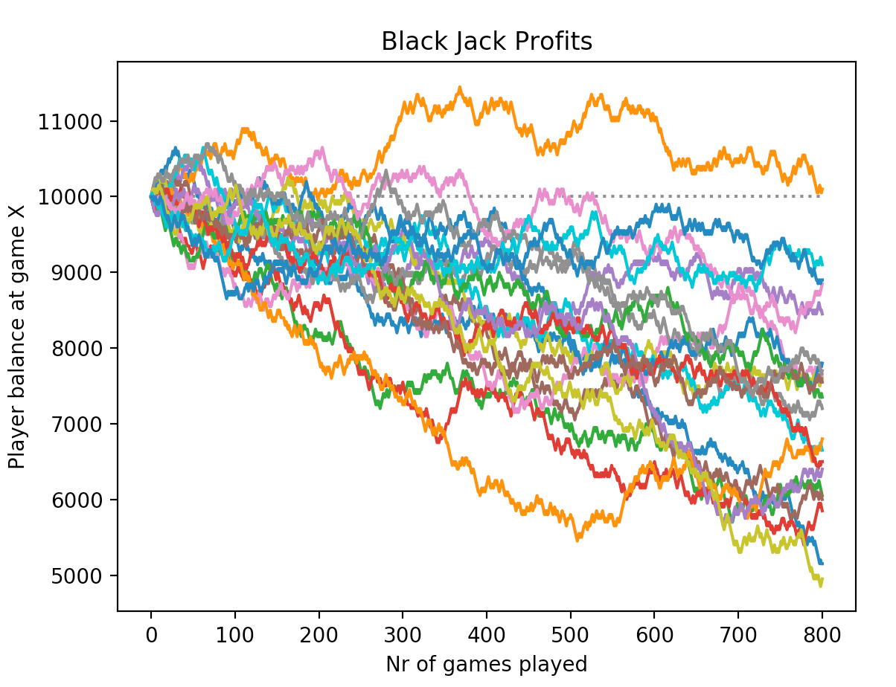

# Black Jack Simulation

## What is this program doing? 

This is a Black Jack Simulator, which allows for simulating thousands(or millions) of rounds of the game. Further, the program can store results and compare payoffs and strategies. 


## Explanation of Code
This simulator is build by taking advantage of object oriented programming. The logic of the game being simulated is buildt from the ground up, that is; no Black Jack packages are used. The simulator is based on three objects:

1. Dealer 
1. Player 
1. Deck of cards

The Dealer and Player object are initiated before the program starts to run many simulations, while the deck of cards is initated each time the simulation loop starts over - this effectively pulls all the cards back into the deck and shuffles it. 

**Dealer**

The dealer class is quite simple, it has an instance variable called *hand*, which stores the players hand. And a **hit()** function that incorporates the rules which states that the dealer must hit (take one more card from the deck) if the sum of his cards are lower than 17. This hit function returns true or false. 

```python
class Dealer:
    def __init__(self):
        self.hand = []

    def hit(self):
        score = sum_hand(self.hand)

        # Dealer strategy (based on the rules of the game)
        if score < 17:
            return True
        else:
            return False
```

**Player**

The player class is almost equal to the *dealer* class except that in addition to the instance variable *hand* the player also has and instance variable *balance*. The **hit()** function is a little more complicated for the player, but not much. The main difference is that the player can see one of the dealer's cards, so knowledge about this one card are incorporated into the player strategy. By changing the strategies in this function, users of this program can experiment with different strategies and compare payoffs over time. 

```python
class Player:
    def __init__(self):
        self.hand = []
        self.balance = 10000

    def hit(self, first_dealer_card):
        score = sum_hand(self.hand)

        # Player strategy
        if score == 8:
            return True
        elif first_dealer_card in ['9', '10', '11', '12', '13', 'ace'] and score < 18:
            return True
        elif score < 16:
            return True
        else:
            return False

```

**Deck of cards** 

The deck of cards class deals with all services a deck provides in the game, that is it stores all the card values, it shuffles the deck, and it deals cards to the players. The two functions are almost equal: **deal_cards()** deals the first to cards that are assigned to all players. **one_more_card()** is called when a player chose to *hit*, and it deals one more card, and removes it from the deck. 

```python
class Deck_of_cards:
    def __init__(self):
        self.dec = ['2', '2', '2', '2',
                '3', '3', '3', '3',
                '4', '4', '4', '4',
                '5', '5', '5', '5',
                '6', '6', '6', '6',
                '7', '7', '7', '7',
                '8', '8', '8', '8',
                '9', '9', '9', '9',
                '10', '10', '10', '10',
                '11', '11', '11', '11',
                '12', '12', '12', '12',
                '13', '13', '13', '13',
                'ace', 'ace', 'ace', 'ace']
        shuffle(self.dec)

    # Return two cards, and remove them from the dec
    def deal_cards(self):
        # Pick the two final cards of the deck
        self.two_cards = self.dec[-2:]
        # Remove the two final cards (<= the cards that have been dealt to a player/dealer)
        self.dec.pop()
        self.dec.pop()
        return self.two_cards

    # This function deals one more card to a player.
    def one_more_card(self):
        # Pick the final card of the deck
        self.card = self.dec[-1:]
        # Remove the card that has been delt
        self.dec.pop()
        return self.card
```

All the classes discussed above are stored in the **game_classes_and_functions.py** file. In addition to these classes the file also contain a helper function that sums a hand. The reason a function is required for this seemingly simple operation is that *aces* can both be worth 1 and 11, it is up to the player. The **sum_hand()** function takes care of this, and returns the players score. 


## Game logic 

The game logic is quite simple, and is written in the main.py file. 

First, an instance of the dealer and player is created:
```python
dealer = Dealer()
player = Player()
```

For each round of Black Jack (for each run of the loop) a deck of cards is initiated. Then a hand is dealt to both the player and the dealer:
```python
# Create a new deck of cards
deck_of_cards = Deck_of_cards()

# Deal cards to dealer
dealer.hand = deck_of_cards.deal_cards()

# Deal cards to players
player.hand = deck_of_cards.deal_cards()
```

After the first cards are dealt a **while** loop runs as long as the player or the dealer still want to hit, if one of them chooses to hit a new card is dealt to them. 

```python
# Decide wheter to hit or stand
while player.hit(dealer.hand[0]) or dealer.hit():

    if player.hit(dealer.hand[0]):
        player.hand += deck_of_cards.one_more_card()

    if dealer.hit():
        dealer.hand += deck_of_cards.one_more_card()
```

Finally, a winner is chosen based on a bunch of if-else-statements.

Additionally, I have also added some code that can be used to save results. OBS! Only results from simulations with the same length can be saved to the same *historic_bets.csv* file, otherwise the pandas dataframe will return an error. 


## Findings From the Simulations 

The simulation is by nature, stochastic, so the exact results that I report here, might not replicate precisely - however, due to the large number of simulations, the *law of large numbers* will generally make the results quite similar. 

Playing 1 000 000 games with the player strategy shown above the results are:

| Player wins | Dealer wins | Tie     |
|-------------|-------------|---------|
| 413 831     | 476 540     | 109 629 |





This simulation clearly illustrate the Dealer's edge in the game of Black Jack. Although the edge is not large, it is more than enough to make sure that the casio wins over time, making it a profitable game for the casino. By its very nature Black Jack is a zero sum game, which means that it is not (generally) profitable for players. It is important to emphasize that these results reflect the strategy of the player, which is described above, this strategy can possibly be improved to make the game a little more even. 

So, what happens (in this simulation) when giving players 10 000 units of currency and letting them play 800 games? 



Well, clearly most players do not benefit financially. It is important to stress that all players follow the exact same strategy, which means that our one player (orange) that barely came out of the casino before losing money, was in no way better than his peers, but rather, had more luck. 

So, out of the 21 players, that were simulated, all but one player lost money. 


# Challenge 

As I have stressed, the results from this simulation is highly dependent on the strategy of the player. I have not put much effort into optimizing this strategy, and whole tables exist which attempts to explain the optimal strategy for a Black Jack player. Feel free to download my code and attempt to improve the distribution of wins from the 1 000 000 simulations that I have described above. 


